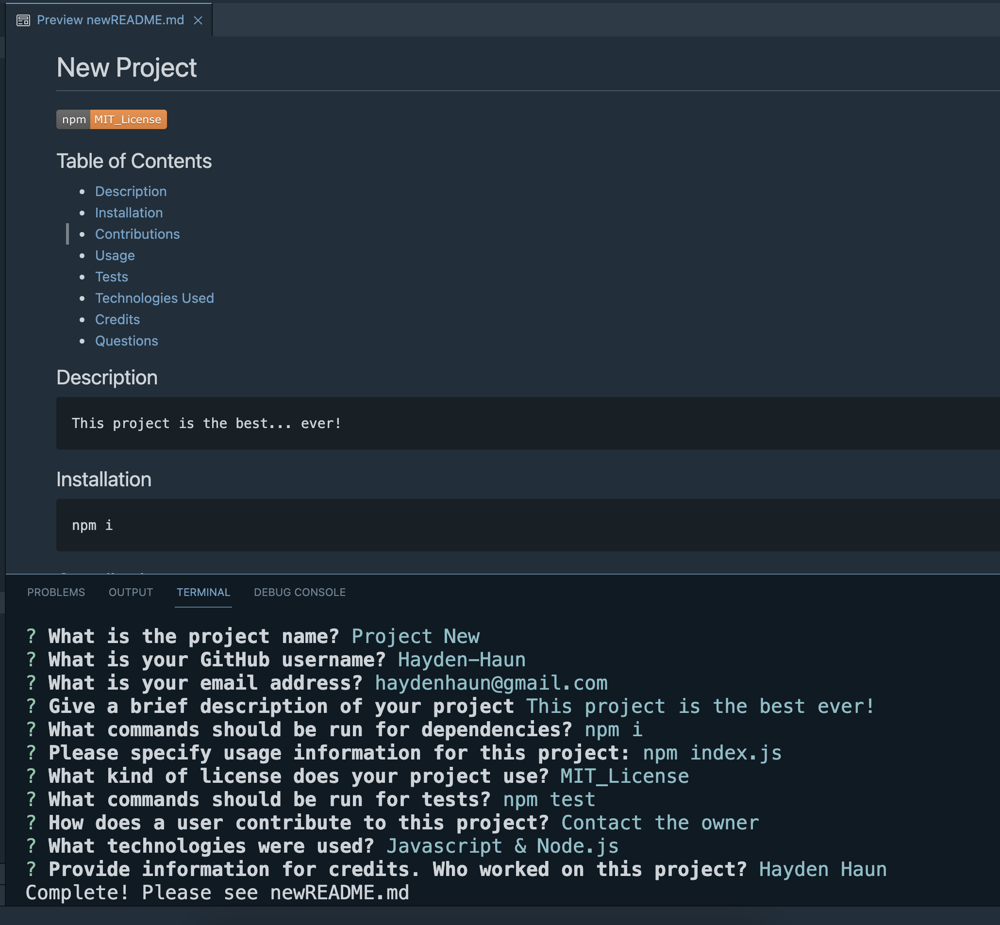

# README GENERATOR

[\* CLICK HERE to download and view a video demonstration](https://github.com/Hayden-Haun/README-GENERATOR/blob/main/Video%20Demonstration-README%20GENERATOR.webm)

## Table of Contents

- [Description](#description)
- [Installation](#installation)
- [Contributions](#contributions)
- [Usage](#usage)
- [Tests](#tests)
- [Technologies Used](#technologies)
- [Credits](#credits)
- [Questions](#questions)

## Description

    This is a command line applications that prompts users with questions about their GitHub project and uses the answers to generate a well formatted README.md file with both a license badge & a table of contents.

## Installation

    npm i

## Contributions

    Contact the owner

## Usage

    npm index.js

## Tests

    none

## Technologies Used

    Javascript & Node.js

## Credits

    Hayden Haun

## Questions

    For additional questions, please contact GitHub user Hayden-Haun at haydenhaun@gmail.com
